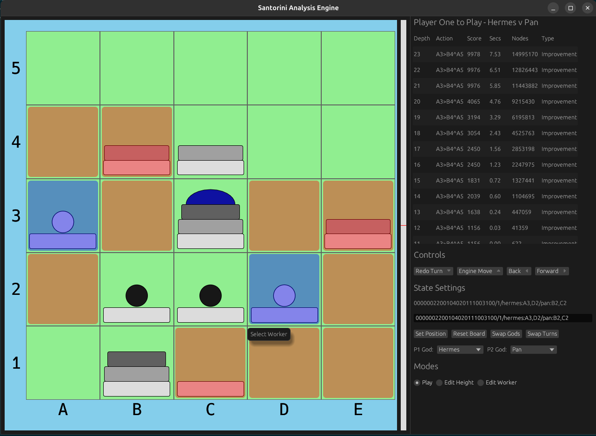

# SANTORINI AI

Santorini AI is a game engine for the board game Santorini, built using negamax search over a NNUE evaluation.  
It has a full implementation of Mortal & Simple God powers, with more powers under development.

Play against the AI on the web [here](https://jpricey.github.io/god-game/)  
OR, check out the analysis engine, runnable as a native app:

[Download here](https://github.com/JPricey/santorini-ai/releases)  

Or, run the UCI-like process, and build your own UI ontop of Santorini AI.

## Running locally
This project requires nightly rust:
`rustup install nightly-2025-07-26`

Run the analysis engine UI:
`cargo run -p ui -r`

Run the standalone UCI, for use with a different UI:
`cargo run -p uci -r`

## Acklowledgements
Big thanks to these other projects for inspiration and tooling:  
[viridithas](https://github.com/cosmobobak/viridithas)  
[bullet](https://github.com/jw1912/bullet)
