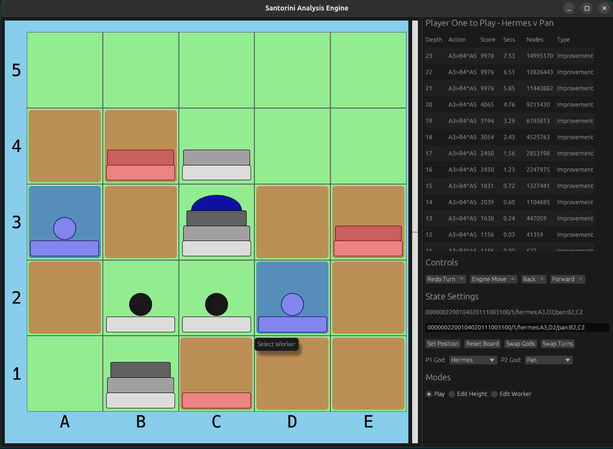

# SANTORINI AI

Santorini AI is a game engine for the board game Santorini, built using negamax search over a NNUE evaluation.  
It has a full implementation of 50+ god powers, with more under development.

Play against the AI on the web [here](https://jpricey.github.io/god-game/)  
OR, check out the analysis engine, runnable as a native app:

[Download here](https://github.com/JPricey/santorini-ai/releases)  

## Running locally
Run the analysis engine UI:
`cargo run -p ui -r`

## Acklowledgements
Big thanks to these other projects for inspiration and tooling:  
[viridithas](https://github.com/cosmobobak/viridithas)  
[bullet](https://github.com/jw1912/bullet)
